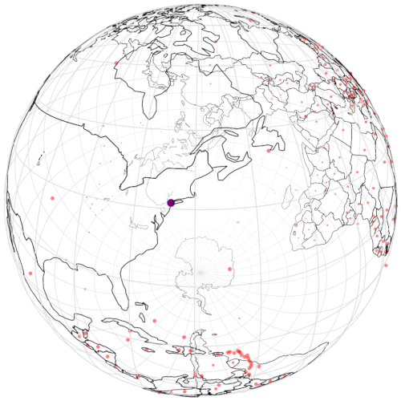

# WIP: globe-js

Globe wireframe visualizations in Javascript backed by
[pinhole-js](https://github.com/tidwall/pinhole-js).

This is a port of [globe](https://github.com/mmcloughlin/globe) for Go. It aims to have a very similar API to the Go version.

## Examples
See the examples in this repo for uses.

